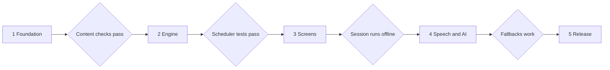

# Wardwise: Medical German for Nurses

Working name: Wardwise. A mobile-first PWA that helps Indian nurses at German A1 to A2 learn ward vocabulary, say it out loud, and keep revisiting the words they get wrong.

## How to use this folder

These files are the single source of truth for the build. Section numbers are kept across files, so "section 6" always means the AI usage plan, wherever it is referenced.

| File | Sections | Contents |
| --- | --- | --- |
| `00-README.md` | 11 | This file: index, build plan, rules for the coding agent |
| `01-PRD.md` | 1, 2, 4, 5 | Product overview, market gap, feature list with acceptance criteria, screens and flow |
| `02-LEARNING-AND-CONTENT.md` | 3, 10 | Learning rules (scheduler, mistake bank, session composer) and the content schema |
| `03-DESIGN.md` | 7, 8 | Visual design system, copy voice, responsive rules |
| `04-TRD.md` | 6, 9 | AI usage plan and technical requirements |
| `05-TESTING-RISKS.md` | 12, 13 | Tests, metrics, risks, open questions, assignment story |

IDs used everywhere: features `F-01` to `F-24`, exercises `E1` to `E10`, screens `S01` to `S13`, topics `T01` to `T08`, goals `G1` to `G5`.

---

## 11. Build plan for the coding agent

The app is built in five phases. Each phase ends in a gate that must be true before the next one starts. The exercise engine and scheduler come first because everything depends on them.



### Phases

| Phase | What gets built | Features | Done when |
| --- | --- | --- | --- |
| 1. Foundation | Repository, Vite and TypeScript, Tailwind with section 7 tokens, bundled fonts, route shell, Dexie schema, content schemas and validator, 20 sample items | None yet | Content validation script passes (draft items only warn; `npm run build:release` fails on any `reviewed: null`) and tokens match section 7 exactly |
| 2. Engine | `scheduler`, `checker`, `composer`, `readiness`, `streak` as pure functions with unit tests | F-10 and the logic behind F-08, F-09, F-15 | Tests cover every rule in section 3: recognition cap, same session retry, recovery rule, streak freeze. Line coverage of `/domain` is at least 95 percent |
| 3. Screens | Navigation shell, S01 to S03, S05 to S07 and a minimal S12 (Settings), exercises E1 to E6 and E9, typed answers only, speech synthesis for audio, seeded demo. S04, S08, S10, S11 and S13 stay placeholders | F-01 to F-08, F-11, F-15, minimal F-18, basic F-14, and the event log part of F-23 | A full session runs start to finish with no AI and no speech recognition, offline: after first load, with the network blocked, navigate inside the app (there is no service worker until Phase 5, so a reload while offline does not work yet) |
| 4. Speech and AI | Speech services, E7, E8, scenarios, Mistake Bank screen and drills, `/api/judge`, cache, quotas, fallbacks | F-09, F-12, F-13 | Every failure case in section 9 has been triggered by hand and behaves as written |
| 5. Release | Full Progress, Daily Case, Hindi hints, PWA, Body Map and Confusable pairs if time allows, feedback form, export and import, performance check, deploy | F-14, F-16, F-17, F-19, F-23, F-24, then F-20, F-21, F-22 | The acceptance run in section 12 passes on a real phone |

Phases are not tied to dates because the deadline is not fixed. Once it is, add dates and cut from the end: P1 and P2 features in phase 5 go first.

### Rules for the coding agent

1. These documents are the source of truth. Refer to features (F-xx), exercises (E1 to E10), screens (S01 to S13) and topics (T01 to T08) by ID in every commit and pull request.
2. If something is not specified, stop and ask. Write the question in `/docs/open-questions.md`. Do not guess.
3. Add no feature, dependency, colour, font or spacing value that is not in these documents.
4. Never write German or Hindi content yourself. Use the reviewed content files. If an item is missing, ask. Draft items (`reviewed: null`) may be used during development; only the release build (`npm run build:release`) rejects them.
5. Build and test the logic in `/domain` before any screen uses it.
6. Call Gemini only from `/api/judge`, and reach it from the browser only through `/services/ai.ts`. Never put the key in client code.
7. One feature ID per commit. Keep commits small.
8. After each phase, add an entry to `CHANGELOG.md` saying what was built and what was learned. This becomes the "v1 to v2" story.
9. A feature is done only when: its acceptance criteria in section 4 are met, logic has unit tests, it works at 390 px and 1280 px wide, it can be used by keyboard, and the console shows no errors.
10. Before writing code for a phase, restate the acceptance criteria of the features in that phase and list the files you will create.

### How to run the agent

- Give it one phase at a time. Name the phase and attach only the files it needs.
- Ask for a short plan before code, and a short summary of what changed after.
- Review the first screen it builds against `03-DESIGN.md` before it builds the rest. Design drift is cheapest to fix early.
- Update these files when a decision changes. The agent follows the latest version.

### Starter message for phase 1

```text
You are building the Wardwise prototype. The attached markdown files are the source of truth.
Read all six files. Do not start coding yet.
1. List anything that is ambiguous or missing for Phase 1. Do not guess; ask.
2. Restate the acceptance criteria for Phase 1.
3. List the files you will create.
Wait for my reply before writing code.
```
