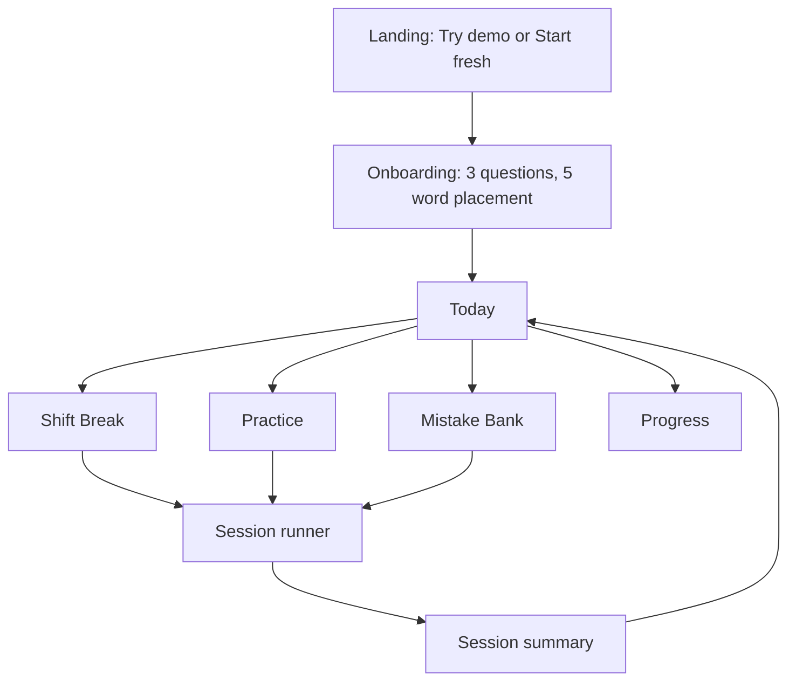

# 01 Product Requirements

Covers sections 1, 2, 4 and 5.

---

## 1. Product overview

Wardwise is a mobile-first web app (PWA) that helps Indian nurses at German A1 to A2 learn ward vocabulary, say it out loud, and keep coming back to the words they get wrong. "Wardwise" is a working name and can change without touching anything else.

**The problem.** How might we help an Indian nurse at A1 to A2 German learn, remember and repeatedly practise medical German in a simple, engaging way? The learner should never reach a screen that says she is finished. The loop is: learn, practise, make a mistake, get feedback, revisit, improve, keep practising.

**Who it is for.** Anjali, a staff nurse in India, aged 24 to 30, working shifts, preparing for a nursing job in Germany. She has A1 or early A2 German, studies on her phone in short breaks, and reads English comfortably. Hindi is an optional support language. She already has a class or tutor; Wardwise is the daily practice layer between classes.

**What the research told us** (desk research only, no interviews yet):

- Language is the main workplace barrier for international nurses in Germany, and job-specific language training helps. Source: [Nursing Open 2023 interview study](https://pubmed.ncbi.nlm.nih.gov/37060232/).
- Training in India is often exam-focused, rarely job-specific, and learners are pushed into B1 and B2 exams without a solid base. Source: [FES report](https://collections.fes.de/publikationen/content/pagetext/1949028).
- Nurse-specific apps exist but mostly serve B1 and above, or doctors. None we reviewed centres on a revisit loop built from the learner's own mistakes.

### Product goals for the prototype

| ID | Goal | How we check it |
| --- | --- | --- |
| G1 | A full practice session takes about 3 minutes | Median session length in test logs |
| G2 | Every wrong answer comes back within 24 hours | Automated test on the scheduler |
| G3 | At least 1 in 3 exercises in a session asks the learner to speak | Count of speaking exercises per session |
| G4 | Learners return the next day | Day 1 return rate among testers. Target: 40 percent or more |
| G5 | Weak words get fixed | Share of Mistake Bank words recovered within 3 days. Target: 50 percent or more |

These are targets for testing, not claims.

### Non-goals for v1

- No B1 or B2 content, no exam preparation, no full grammar course
- No real accounts, passwords, payments or server-side user database
- No social features, leaderboards or chat with other users
- No pronunciation scoring. We check what was said, not how it sounded
- No clinical guidance. This is a language tool and the app says so

### Assumptions the build must follow

1. Learners use mostly Android Chrome on a phone, and sometimes a laptop.
2. Progress lives on the device (IndexedDB). "Login" is a demo profile, not security.
3. All teaching content is written in advance and checked by a German speaker. The app never invents vocabulary at run time.
4. The AI is the free Gemini API, called sparingly (see section 6).
5. English is the base language. Hindi is an optional hint. Other Indian languages are out of scope for v1.

### Words used in these documents

| Term | Meaning |
| --- | --- |
| Item | One thing to learn: a word, a phrase or a sentence |
| Session | One practice run of up to 10 exercises, about 3 minutes |
| Due item | An item the scheduler says should be reviewed now |
| Weak item | An item currently in the Mistake Bank |
| Strong item | An item in box 4 or 5 (section 3) |
| Ward Readiness | The percentage of items in a topic that are strong |
| Scenario | A short scripted ward conversation, for example a pain check |

---

## 2. Market gap and differentiators

The nurse and medical German apps we reviewed give learners word lists, dialogues and audio. None of the ones we checked builds each day's practice from the learner's own mistakes, and few focus on A1 to A2.

| Product | Aimed at | What it offers | Gap for our user |
| --- | --- | --- | --- |
| [vhs Pflege](https://apps.apple.com/us/app/id6743324650) | Nursing learners, free | Short nursing courses, varied exercises, offline use, tutor support | Course-style, not a daily revisit loop |
| [Medical German Language](https://apps.apple.com/us/app/-/id6446804370) | Doctors, nurses, pharmacists | 500+ terms by category, communication practice, paid upgrades | Broad medical scope, not beginner nurse paths |
| [German for Nurses](https://apps.apple.com/us/app/-/id6756078684) | Nurses and carers | Vocabulary, dialogues, audio, offline | Content library, no visible mistake tracking |
| [NursePlus](https://apps.apple.com/bs/app/id6749846255) | Hospitals and nurses | Kenntnisprüfung simulations, A1 to B2 clinical German | Facility and exam focus |
| Duolingo, Babbel, Busuu, Anki | General learners | Habit, structure, flashcards | Not nursing specific, limited speaking, Anki has none |

This table comes from store listings, not from using each app. Before the demo, install two or three of them and record what they really do. If a competitor already has one of the features below, say so and explain how ours differs.

### The six signature features

1. **Shift Break.** One button builds a 3 minute session from what the learner needs most today: due reviews, weak words and a few new words.
2. **Mistake Bank with error types.** Every wrong answer is saved with a reason: article, spelling, meaning, listening, word order, grammar, number. The bank drives targeted drills.
3. **Say it first.** She sees an English prompt (or hears it, with Hindi if switched on) and speaks the German before seeing it.
4. **Vitals and dosage dictation.** She hears German numbers the way a patient or doctor would say them and types what she heard.
5. **Ward scenarios.** Short scripted conversations such as admission or a pain check. Patient lines are written in advance. The AI only judges the nurse's free reply.
6. **Ward Readiness.** Progress is shown by ward task ("Pain check: 72 percent ready"), not by points.

### Supporting touches

- Body Map: a tappable line drawing for body-part words, with audio.
- Confusable pairs: words nurses mix up, drilled side by side.
- Article colours: der, die and das always shown in the same colour.
- Optional Hindi hints on tricky words.

These features are hypotheses. The test plan in section 12 is how we find out which ones learners actually use.

---

## 4. Feature specification

24 numbered features. P0 must work before anything else is started, P1 is built once P0 is stable, P2 only if time remains. The build agent refers to features by ID and does not add features that are not listed.

| ID | Feature | Priority | Acceptance criteria |
| --- | --- | --- | --- |
| F-01 | Demo login | P0 | Landing screen has "Try demo" and "Start fresh". Demo loads a seeded profile with a 9 day streak, 40 items with mixed boxes, 6 Mistake Bank items. Start fresh asks for a first name only. No password anywhere |
| F-02 | Onboarding and placement | P0 | 3 questions (goal, daily time, German level in own words) then the 5 item placement from section 3. Takes under 90 seconds. Result can be changed in Settings |
| F-03 | Today screen | P0 | Shows: Shift Break button, items due in next 24 hours, streak, Ward Readiness for the 3 weakest topics, Daily Case card. Opens in under 2 seconds on a mid range phone after first load |
| F-04 | Session runner | P0 | Builds a session with the composer in section 3. Shows progress as "4 of 10". Exit asks for confirmation and saves answered items. Ends with a summary: items right, items to revisit, next review time |
| F-05 | Learn card and audio | P0 | E1 shows German with colour coded article, plural if any, English meaning, example sentence, audio button for word and sentence. Audio uses browser speech synthesis in German. Slow audio option at 0.8 speed |
| F-06 | Recognition exercises | P0 | E2 to E5 implemented. E2 offers der, die and das. E3, E4 and E5 offer 4 options, with distractors from the same topic and kind, then the same level and kind, then any item of the same kind. Options shuffled. Correct answer never always in the same position |
| F-07 | Production exercises | P0 | E6 type it and E7 say it first. E7 uses speech recognition in German with a visible "Type instead" button. If speech is unsupported, E7 is replaced by E6 automatically |
| F-08 | Answer checking and feedback | P0 | Rule based check first (section 6). Every wrong answer shows: the correct answer, one sentence on why, the error type. Never only "wrong". Feedback in under 300 ms for rule based checks |
| F-09 | Mistake Bank and drills | P0 | Lists weak items grouped by error type with counts. "Drill this group" starts a session of up to 10 items from that group. Recovery rule from section 3 implemented and unit tested |
| F-10 | Scheduler | P0 | Box and due time rules from section 3 as pure functions with unit tests covering correct, wrong, recognition cap and same session retry |
| F-11 | Number dictation | P0 | E9 plays a German number or value (blood pressure, temperature, dose count) and the learner types digits. Accepts comma or dot for decimals. Wrong answers tagged `number` |
| F-12 | Sentence builder | P1 | E8 shows 5 to 9 word chips, learner taps them in order. Checked by exact match against allowed orders in the content file |
| F-13 | Ward scenarios | P0 | At least 3 scripted scenarios (admission, pain check, taking vitals). Each has 4 to 6 turns. Learner replies by speaking or typing. Rule check first, AI judge only for free replies (section 6). Ends with a short debrief listing phrases to practise |
| F-14 | Progress and Ward Readiness | P0 | Per topic percent of Strong items, per level totals, a streak calendar for the last 28 days, counts of New, Learning and Strong items |
| F-15 | Streak, freeze and daily goal | P0 | Rules from section 3 implemented. Streak survives a missed day only if a freeze is available. Today shows streak and freezes held |
| F-16 | Daily Case | P1 | One scenario per day chosen by day of year (A1 learners get a 5 exercise A1 mini session instead, until A2 opens). About 2 minutes. Counts toward the streak |
| F-17 | Hindi hints | P1 | Setting off by default. When on, tricky items show a Hindi hint under the English meaning in Noto Sans Devanagari. Items without a hint show none |
| F-18 | Settings | P0 | Level switch, session length (5, 10, 15), Hindi hints, speech on or off, audio speed, reset progress, export progress |
| F-19 | PWA and offline | P1 | Installable on Android and desktop Chrome. All content and rule based exercises work offline. AI features show a clear "Needs internet" note offline |
| F-20 | Body Map | P1 | A tappable line drawing for T01. Tapping a region shows the word and plays audio. Includes a quiz mode: "Tap the Bauch" |
| F-21 | Confusable pairs | P1 | A drill mode showing two easily mixed items together (for example links and rechts). Pairs defined in the content file |
| F-22 | Weekly recap | P2 | Monday card on Today with words fixed and new Strong words from the last 7 days |
| F-23 | Feedback and event log | P0 | A "Send feedback" button on every screen opens a short form saved locally and exportable. Key events logged locally: session start, session end, exercise result, speech use, AI call, fallback use |
| F-24 | Data export and import | P1 | Export all progress as one JSON file. Import restores it. Used for the demo and for moving between devices |

### Cut from v1 on purpose

Leaderboards and friends, push notifications (unreliable on iPhones), user accounts, B1 content, free chat with an AI tutor, pronunciation scoring, and any AI generated teaching content at run time.

---

## 5. User flow and screen map

One hub, the Today screen. Every practice path starts and ends there.

### Screens

| ID | Screen | Purpose | Key contents |
| --- | --- | --- | --- |
| S01 | Landing | Get in with no friction | App name, one line of what it is, "Try demo" and "Start fresh" buttons, a small note that progress stays on this device |
| S02 | Onboarding | Set a starting point | 3 questions, then the 5 item placement, then a short result screen |
| S03 | Today | Hub and reason to return | Shift Break button, items due in 24 hours, streak and freezes, 3 weakest topics with Ward Readiness, Daily Case card |
| S04 | Practice | Choose what to practise | Level switch (A1, A2), topic list with readiness bars, entries for Scenarios, Number dictation, Body Map, Confusable pairs |
| S05 | Session runner | Do the exercises | One exercise at a time, progress "4 of 10", exit button. Navigation hidden for focus |
| S06 | Feedback panel | Teach from every answer | Right or wrong, correct answer, one sentence why, error type, Next button. Bottom sheet on mobile, inline panel on desktop |
| S07 | Session summary | Close the loop | Items right, items to revisit, next review time, buttons: Back to Today, Extra round |
| S08 | Mistake Bank | Fix patterns | Weak items grouped by error type with counts, "Drill this group" button, items recovered this week |
| S09 | Scenario runner | Practise real conversations | Patient line (text and audio), reply area for speech or typing, turn counter, debrief at the end |
| S10 | Progress | Show real improvement | Ward Readiness per topic, counts of New, Learning and Strong items, 28 day streak calendar |
| S11 | Word detail | Look up any item | Article colour, plural, English and optional Hindi, example sentence, audio, current box, history of right and wrong answers |
| S12 | Settings | Control the app | Level, session length, Hindi hints, speech on or off, audio speed, reset, export and import |
| S13 | Feedback form | Collect test feedback | Short form: what happened, what you expected, a rating. Saved locally and exportable |

### Navigation

- Mobile: bottom tab bar with four tabs: Today, Practice, Mistakes, Progress. Settings opens from an icon at the top right of Today.
- Desktop (1024 px and wider): the same four destinations in a left rail, Settings at the bottom of the rail.
- The session runner and scenario runner hide all navigation. Leaving asks "Leave this session? Your answers so far are saved."
- Routes: `/` landing, `/start` onboarding, `/today`, `/practice`, `/session/:id`, `/scenario/:id`, `/mistakes`, `/progress`, `/word/:id`, `/settings`, `/feedback`.
- With no profile, only `/` (the landing screen) is shown, and every other route goes to `/`. Start fresh asks for a first name on S01, creates the profile and goes to `/start`. A profile that has not completed onboarding is always sent to `/start`. A returning learner opens on `/today`, and `/` and `/start` go there for them. Unknown URLs go to `/`.
